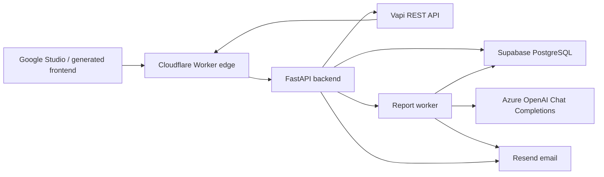

# Voice Assessment Backend Architecture

## Runtime Responsibilities

- Cloudflare Worker: edge request ID injection, CORS/security headers, Vapi webhook HMAC pre-validation, and proxying to the FastAPI origin.
- FastAPI API: auth, RBAC, assessment/session/report/admin APIs, Vapi webhook idempotency, and durable report status state.
- Supabase PostgreSQL: source of truth for users, assessments, sessions, reports, webhook idempotency, and analytics.
- Report worker: claims pending or stale report jobs from PostgreSQL and performs Azure OpenAI report generation with its own async DB session.
- Vapi: conducts the voice assessment call and posts signed webhook events back to `/api/v1/webhooks/vapi`.
- Azure OpenAI: produces structured diagnostic report JSON from transcript and assessment context.
- Resend: sends scheduled-assessment, report-ready, and admin-alert transactional emails.

## Request Flow

1. The frontend authenticates through `/api/v1/auth/login` and calls API endpoints through the Cloudflare Worker.
2. Admin or assessor creates an assessment and session.
3. Admin or assessor starts a phone call with `POST /api/v1/sessions/{session_id}/start-call`, or the candidate starts a browser voice call through the Vapi Web SDK.
4. For phone calls, the API calls Vapi `/call` with `assistantId`, configured `phoneNumberId`, `customer.number`, and session metadata. For browser calls, the frontend starts the call with the Vapi public key and binds the returned call ID back to the backend session.
5. Vapi posts signed webhook events to `/api/v1/webhooks/vapi`.
6. The Worker validates the webhook signature at the edge, then FastAPI validates it again before any DB work.
7. The API stores webhook idempotency state and updates the assessment session transcript/status.
8. `analysis.done` creates a durable pending report record and schedules report generation.
9. The report worker or in-process background task generates the Azure OpenAI report, stores token usage, and sends Resend email.

## Trust Boundaries

- Browser clients never receive service-role Supabase credentials, Azure OpenAI keys, private Vapi keys, Resend keys, or JWT signing secrets.
- Vapi webhook signatures are checked before database work.
- Admin APIs require `UserRole.admin`; candidate access is scoped to owned sessions/reports.
- Soft deletes preserve auditability across user, assessment, session, report, and webhook records.
